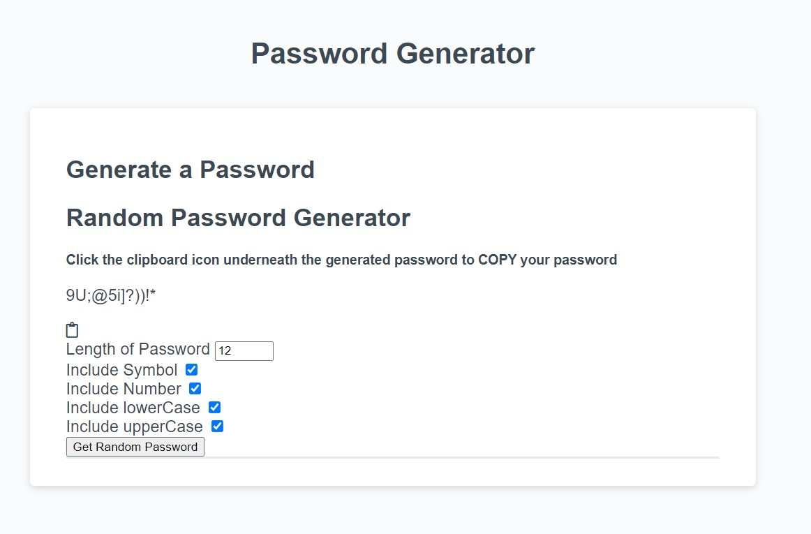

# Password Generator Starter Code
# README 03.2

## CHA03 Challenge: JavaScript Password Generator  

The Challenge 03: Password Generator project was significantly more difficult in execution than in conception for me. I knew a whole giant bag of tools that could be used in the HTML, CSS, and JavaScript worlds, and how they might interact, but figuring out where to start was daunting, other than a tiny bit of source code provided to us.

That being the case, after reviewing the assignment closely, I went out into the internet to see how other people did their own Password Generator at GitHub and other public, open-source sites. Some were decent but were missing one or two things I wanted in my own; some looked good but weren't fully functional or were missing a major part so the generator wouldn't execute as intended; and most were other learners of code struggling themselves with varying degrees of working and non-working code.

At this point, I bookmarked and took notes on the one's I liked either visually or code-wise or both, and started pulling from some as I experimented with different combinations of my own. Ultimately, I decided to do very little styling, because for me a password generator should look and behave in a very utilitarian way. I pulled in a lot of code we weren't given and ignored some of the code we *were* given. In light of this, I might have gone outside the bounds of the assignment in terms of what type of language I used, but in the end I felt it was worth the experience.

## Usage

To add a screenshot, create an `assets/images` folder in your repository and upload your screenshot to it. Then, using the relative filepath, add it to your README using the following syntax:

    ```md
    
    ```

### Stylesheets and other links

Used the following Stylesheet:

```
<!-- Stylesheet: Font Awesome Free 5.10.2 by @fontawesome - https://fontawesome.com
* License - https://fontawesome.com/license/free (Icons: CC BY 4.0, Fonts: SIL OFL 1.1, Code: MIT License)-->
```

I used the following programs either directly or indirectly to help with this project:

- [VS Code](https://code.visualstudio.com/)
- [WebStorm](https://www.jetbrains.com/webstorm/)
- [Chrome](https://www.google.com/chrome/)
- [Ulysses](https://ulysses.app/)
- [Obsidian](https://obsidian.md/)
- [Typora](https://typora.io/)

The following websites were used and/or consulted to varying degrees:

- [GitHub](https://github.com/)
- [GitLab](https://about.gitlab.com/)
- [The Full-Stack Blog: Professional README Guide](https://coding-boot-camp.github.io/full-stack/github/professional-readme-guide)
- [Mozilla MDN Web Docs](https://developer.mozilla.org/en-US/)
- [W3Schools HTML Tutorial](https://www.w3schools.com/html/default.asp)
- [Dev Community](https://dev.to/)
- [Tutorials Tonight](https://www.tutorialstonight.com/)
- [Geeks For Geeks](https://www.geeksforgeeks.org/)
- [Scaler](https://www.scaler.com/)
- [Passwords Generator](https://passwords-generator.org/)
- [EnvantoTuts+](https://tutsplus.com/)

##  Licenses

**MIT License**

Permission is hereby granted, free of charge, to any person obtaining a copy of this software and associated documentation files (the "Software"), to deal in the Software without restriction, including without limitation the rights to use, copy, modify, merge, publish, distribute, sublicense, and/or sell copies of the Software, and to permit persons to whom the Software is furnished to do so, subject to the following conditions:

The above copyright notice and this permission notice shall be included in all copies or substantial portions of the Software.

THE SOFTWARE IS PROVIDED "AS IS", WITHOUT WARRANTY OF ANY KIND, EXPRESS OR IMPLIED, INCLUDING BUT NOT LIMITED TO THE WARRANTIES OF MERCHANTABILITY, FITNESS FOR A PARTICULAR PURPOSE AND NON-INFRINGEMENT. IN NO EVENT SHALL THE AUTHORS OR COPYRIGHT HOLDERS BE LIABLE FOR ANY CLAIM, DAMAGES OR OTHER LIABILITY, WHETHER IN AN ACTION OF CONTRACT, TORT OR OTHERWISE, ARISING FROM, OUT OF OR IN CONNECTION WITH THE SOFTWARE OR THE USE OR OTHER DEALINGS IN THE SOFTWARE.

Copyright (c) 2023 thebizzle81 (Jesse F. Brenner)

